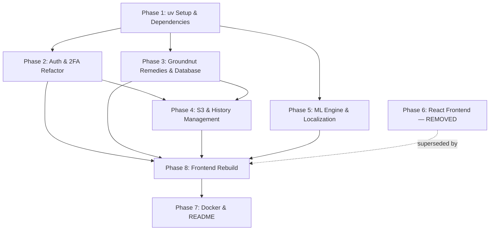

# Plant-Aid: Granular Development Plan & Task Breakdown

**Companion Documents:**

- [`Docs/Implementation.md`](Plant-Aid/Docs/Implementation.md)
- [`Docs/plan.md`](Plant-Aid/Docs/plan.md)
- [`Docs/Software_Requirement_Document.md`](Plant-Aid/Docs/Software_Requirement_Document.md)
- [`Docs/Design_Document_And_Structure_Chart.md`](Plant-Aid/Docs/Design_Document_And_Structure_Chart.md)

---

## Tooling & Runtime Standard

All Python environments, dependency management, scripts, and tests **must** use **`uv`**:

- Virtual environment: `uv venv`
- Package management: `uv pip install <package>` or `uv add <package>`
- Script execution: `uv run python <script.py>`
- Test runner: `uv run pytest`
- Server launch: `uv run uvicorn app.main:app --reload`

**Sanctioned exception — Google Colab:** `backend/ml/COLAB.md` documents the GPU training
workflow, which runs on a managed Colab runtime where `uv` is not the provisioned toolchain.
Plain `pip install` / `python <script>.py` cells are correct **in that document only**; the
same scripts run locally via `uv run python ...`. Everywhere else the standard applies
without exception.

The frontend — when it is rebuilt in Phase 8 — uses **Node.js v22+** and **npm** with
**Vite + React + Tailwind CSS**. No frontend is present on this branch.

---

## Phase Breakdown Overview

```
Phase 1: Environment Setup with uv & Dependencies
   │
Phase 2: Backend Core & Security Refactoring (Module 0.1)
   │
Phase 3: Database & Groundnut Remedy Alignment (Module 0.4)
   │
Phase 4: S3 Media Storage & History Management (Module 0.5)
   │
Phase 5: ML Inference Engine & Two-Layer Localization (Module 0.3)
   │
Phase 6: Frontend React.js Application — REMOVED (28/09/26, branch `frontend-cleanup`)
   │
Phase 8: Frontend Rebuild (Module 0.2 & GUI) — NOT STARTED
   │
Phase 7: DevOps, Containerization & Root Documentation
```

Phases 1–5 are complete and verified. Phase 6 was delivered and then deliberately removed so the
UI can be rebuilt from scratch; its replacement, Phase 8, is the remaining implementation work.
Phase 7 is complete except for the container stack (Task 7.1), whose frontend service now waits on
Phase 8.

---

## Phase 1: Environment Setup with `uv` & Dependencies

### Task 1.1: Initialize `uv` Virtual Environment & Dependencies

- [x] **Goal:** Create a clean, reproducible Python environment managed entirely via `uv`.
- [x] **Files to touch:**
  - `backend/requirements.txt`
  - `backend/pyproject.toml`
- [x] **Steps:**
  1. Initialize venv:
     ```bash
     cd backend
     uv venv
     ```
  2. Add updated dependencies to `backend/requirements.txt`:
     - `fastapi>=0.110.0`
     - `uvicorn[standard]>=0.28.0`
     - `sqlalchemy>=2.0.28`
     - `pydantic>=2.6.0`
     - `pydantic-settings>=2.2.0`
     - `email-validator>=2.1.0`
     - `pyjwt>=2.8.0`
     - `passlib[bcrypt]>=1.7.4`
     - `bcrypt>=4.0.0`
     - `boto3>=1.34.0`
     - `python-multipart>=0.0.9`
     - `slowapi>=0.1.9`
     - `opencv-python-headless>=4.9.0`
     - `torch>=2.2.0`
     - `torchvision>=0.17.0`
     - `timm>=0.9.16`
     - `numpy>=1.26.0`
     - `alembic>=1.13.0`
     - `pytest>=8.0.0`
     - `httpx>=0.27.0`
  3. Install dependencies:
     ```bash
     uv pip install -r requirements.txt
     ```
- [x] **Acceptance Criteria:** `uv run python -c "import fastapi, torch, cv2, slowapi; print('Environment OK')"` exits with code 0.

### Task 1.2: Environment Configuration & Defaults

- [x] **Goal:** Create `.env.example` and update `app/config.py` to support all configurable services.
- [x] **Files to touch:**
  - `backend/.env.example`
  - `backend/app/config.py`
- [x] **Config Fields:**
  - `DATABASE_URL` (default: `sqlite:///./plant_aid.db`, production: postgres)
  - `SECRET_KEY`, `ALGORITHM`, `ACCESS_TOKEN_EXPIRE_MINUTES`, `OTP_EXPIRE_MINUTES`
  - `AWS_ACCESS_KEY_ID`, `AWS_SECRET_ACCESS_KEY`, `AWS_REGION`, `S3_BUCKET_NAME`
  - `OTP_PROVIDER` (`console` | `twilio` | `sendgrid`)
  - `TWILIO_ACCOUNT_SID`, `TWILIO_AUTH_TOKEN`, `TWILIO_PHONE_NUMBER`
  - `SENDGRID_API_KEY`, `SENDGRID_FROM_EMAIL`
  - `RATE_LIMIT_PER_MINUTE` (default: `60`)
  - `CONFIDENCE_THRESHOLD` (default: `0.55`)
- [x] **Acceptance Criteria:** `uv run python -c "from app.config import settings; print(settings.APP_NAME)"` succeeds.

---

## Phase 2: Backend Core & Security Refactoring (Module 0.1)

### Task 2.1: Bcrypt Password Hashing Migration

- [x] **Goal:** Replace custom SHA-256 with industry-standard bcrypt hashing per `Implementation.md` §2.2.
- [x] **Files to touch:**
  - `backend/app/security.py`
- [x] **Details:**
  - Use `passlib.context.CryptContext(schemes=["bcrypt"], deprecated="auto")`.
  - Implement `hash_password(password: str) -> str` and `verify_password(plain: str, hashed: str) -> bool`.
- [x] **Acceptance Criteria:** Passwords verified with constant-time bcrypt checks.

### Task 2.2: User Registration & 409 Conflict Handling

- [x] **Goal:** Enforce unique email/phone constraints with proper HTTP status codes.
- [x] **Files to touch:**
  - `backend/app/routers/auth.py`
  - `backend/app/schemas.py`
- [x] **Details:**
  - Check existing `email_address` OR `phone_number`.
  - Return HTTP `409 Conflict` (per `Implementation.md` §2.2) when duplicates are found.
  - Return HTTP `201 Created` with created `user_id`.
- [x] **Acceptance Criteria:** Duplicate registration triggers `409 Conflict`.

### Task 2.3: 2FA Challenge & Session Token Refactoring

- [x] **Goal:** Align `/auth/login` to return an opaque, signed `session_id` rather than exposing the raw `user_id`.
- [x] **Files to touch:**
  - `backend/app/routers/auth.py`
  - `backend/app/models.py`
  - `backend/app/schemas.py`
- [x] **Details:**
  - Login accepts `email` OR `phone` + `password`.
  - Return generic `401 Unauthorized` on mismatch (prevent user-enumeration).
  - Generate a secure `session_id` (UUIDv4) stored on the user row along with `active_2fa_otp`, `otp_expiry_time` (5 min TTL), and `failed_otp_attempts` (default 0).
  - Return `{"session_id": session_id, "expires_in": 300}`.
- [x] **Acceptance Criteria:** `POST /auth/login` yields `{session_id}` without exposing `user_id`.

### Task 2.4: Pluggable OTP Dispatch Service

- [x] **Goal:** Implement `backend/app/services/otp_service.py` supporting console dev logging, Twilio SMS, and SendGrid Email.
- [x] **Files to touch:**
  - `backend/app/services/otp_service.py` [NEW]
- [x] **Details:**
  - Interface: `send_otp(destination: str, otp_code: str, channel: str = "auto") -> bool`.
  - If `OTP_PROVIDER == "console"` (dev mode): print OTP formatted in server logs.
  - If `OTP_PROVIDER == "twilio"`: dispatch SMS via Twilio REST API.
  - If `OTP_PROVIDER == "sendgrid"`: dispatch email HTML template via SendGrid.
- [x] **Acceptance Criteria:** OTP dispatches according to configured provider.

### Task 2.5: OTP Verification with Brute-Force Rate Capping

- [x] **Goal:** Implement secure verification in `POST /auth/verify-2fa`.
- [x] **Files to touch:**
  - `backend/app/routers/auth.py`
  - `backend/app/schemas.py`
- [x] **Details:**
  - Input schema: `{"session_id": str, "otp_code": str}`.
  - Lookup user by `session_id`.
  - If `failed_otp_attempts >= 5`: invalidate challenge, return `429 Too Many Requests` or `401 Unauthorized` with lock notice.
  - Constant-time OTP string comparison.
  - Check expiry time.
  - Invalidate OTP on success and reset attempt counter.
  - Issue JWT access token (HS256, 60-min expiry per spec).
- [x] **Acceptance Criteria:** 5 failed attempts locks session; valid OTP issues JWT.

### Task 2.6: Route URL Aliasing

- [x] **Goal:** Support both `/auth/*` and `/api/auth/*` for client flexibility.
- [x] **Files to touch:**
  - `backend/app/main.py`
  - `backend/app/routers/auth.py`
- [x] **Acceptance Criteria:** `POST /auth/login` and `POST /api/auth/login` resolve to the same handler.

### Task 2.7: Module 0.1 Unit & Integration Tests

- [x] **Goal:** Test registration, login, 2FA challenge, verification, attempt limits, and `/auth/me`.
- [x] **Files to touch:**
  - `backend/tests/test_auth.py` [NEW]
- [x] **Command:** `uv run pytest tests/test_auth.py`
- [x] **Acceptance Criteria:** 100% tests pass.

---

## Phase 3: Database & Groundnut Remedy Alignment (Module 0.4)

### Task 3.1: Data Schema Verification & Normalization

- [x] **Goal:** Ensure `diseases` and `remedies` tables align with `ml_config.CLASS_DISPLAY`.
- [x] **Files to touch:**
  - `backend/app/models.py`
- [x] **Details:**
  - `disease_id` supported as integer (1 through 6) or slug (`early_leaf_spot`, etc.).
  - Fields: `plant_species`, `disease_name`, `scientific_name`, `severity_level`.
  - Remedy categories: `Organic / Biological`, `Chemical / Fungicide`, `Preventive Cultural Practice`.

### Task 3.2: Groundnut Disease & Remedy Data Seeder

- [x] **Goal:** Seed the 6 official Groundnut classes audited in `plan.md` into Store D2.
- [x] **Files to touch:**
  - `backend/seed.py`
- [x] **Seeded Classes:**
  1. `early_leaf_spot` — Groundnut Early Leaf Spot (_Cercospora arachidicola_)
  2. `early_rust` — Groundnut Early Rust (_Puccinia arachidis_)
  3. `healthy_leaf` — Healthy Leaf (_Arachis hypogaea_)
  4. `late_leaf_spot` — Groundnut Late Leaf Spot (_Phaeoisariopsis personata_)
  5. `nutrition_deficiency` — Nutrition Deficiency (Nitrogen/Iron/Zinc chlorosis)
  6. `rust` — Groundnut Rust (_Puccinia arachidis_)
- [x] **Details:** Curate 3 detailed remedies (Organic, Chemical, Cultural) with application instructions and safety warnings for each class.
- [x] **Command:** `uv run python seed.py`
- [x] **Acceptance Criteria:** Database populated with 6 groundnut classes and 18 remedy records.

### Task 3.3: Remedy Lookup Endpoints

- [x] **Goal:** Implement endpoints defined in `Implementation.md` §5 & §8.
- [x] **Files to touch:**
  - `backend/app/routers/remedy.py`
  - `backend/app/schemas.py`
- [x] **Endpoints:**
  - `GET /remedies/{disease_id}`: Returns grouped remedy tabs (Organic, Chemical, Cultural).
  - `GET /remedies`: List/search remedies with optional category or query filters.
- [x] **Acceptance Criteria:** `GET /remedies/1` or `GET /remedies/early_leaf_spot` returns full treatment tabs.

### Task 3.4: Alembic Migrations Setup

- [x] **Goal:** Configure Alembic for relational migrations (PostgreSQL / SQLite).
- [x] **Files to touch:**
  - `backend/alembic.ini` [NEW]
  - `backend/alembic/env.py` [NEW]
- [x] **Command:**
  ```bash
  cd backend
  uv run alembic init alembic
  uv run alembic revision --autogenerate -m "initial_schema"
  uv run alembic upgrade head
  ```
- [x] **Acceptance Criteria:** Alembic manages schema creation cleanly.

### Task 3.5: Module 0.4 Verification Tests

- [x] **Goal:** Test remedy lookup by ID and slug.
- [x] **Files to touch:**
  - `backend/tests/test_remedies.py`
- [x] **Command:** `uv run pytest tests/test_remedies.py`
- [x] **Acceptance Criteria:** All remedy tests pass.

---

## Phase 4: S3 Media Storage & History Management (Module 0.5)

### Task 4.1: S3 Presigned URL & Service Refactoring

- [x] **Goal:** Generate time-limited presigned GET URLs (15-min TTL) for thumbnails per `Implementation.md` §6.2.
- [x] **Files to touch:**
  - `backend/app/services/storage.py`
  - `backend/app/config.py`
- [x] **Details:**
  - Add `generate_presigned_url(s3_uri: str, expiration_seconds: int = 900) -> str`.
  - If using local storage fallback: return static local URL `/uploads/{filename}`.
  - S3 key format: `frames/{user_id}/{yyyy}/{mm}/{dd}/{frame_id}.jpg`.
- [x] **Acceptance Criteria:** History endpoints return accessible presigned image URLs.

### Task 4.2: S3 Compensation & Rollback

- [x] **Goal:** Prevent orphaned S3 objects if database transaction fails.
- [x] **Files to touch:**
  - `backend/app/services/storage.py`
  - `backend/app/routers/inference.py`
  - `backend/app/routers/history.py`
- [x] **Details:**
  - Add `delete_object(s3_uri: str) -> None`.
  - Wrap diagnosis logging in try/except; delete S3 file if DB commit fails.
- [x] **Acceptance Criteria:** Failed DB writes remove the uploaded S3 object.

### Task 4.3: Explicit Diagnosis Logging Endpoint
- [x] **Goal:** Implement `POST /history` per `Implementation.md` §6.2 (log diagnosis on user button click, not on every live polled frame).
- [x] **Files to touch:**
  - `backend/app/routers/history.py`
  - `backend/app/schemas.py`
- [x] **Details:**
  - Payload: `{ disease_id, confidence_score, s3_storage_uri, bounding_box }`.
  - Writes to D3 `diagnosis_history` table.
  - Returns `{"log_id": int, "status": "confirmed", "timestamp": str}`.
- [x] **Acceptance Criteria:** Only explicit user logging calls create historical records.

### Task 4.4: Paginated History Dashboard
- [x] **Goal:** Implement `GET /history` with pagination, ordering, and filters.
- [x] **Files to touch:**
  - `backend/app/routers/history.py`
- [x] **Details:**
  - Query params: `page` (default 1), `limit` (default 20), `disease_id` (optional), `date_from` (optional), `date_to` (optional).
  - Enriches records with human-readable disease name and presigned image thumbnail URL.
- [x] **Acceptance Criteria:** `GET /history?page=1&limit=10` returns paginated, enriched records.

### Task 4.5: Module 0.5 Verification Tests
- [x] **Goal:** Automated tests for history logging, presigned URL creation, pagination, and deletion.
- [x] **Files to touch:**
  - `backend/tests/test_history.py` [NEW]
- [x] **Command:** `uv run pytest tests/test_history.py`
- [x] **Acceptance Criteria:** All history tests pass.

---

## Phase 5: ML Inference Engine & Two-Layer Localization (Module 0.3)

### Task 5.1: `ml_engine.py` Singleton & Fallback Architecture
- [x] **Goal:** Create production inference service loading TorchScript model and labels.
- [x] **Files to touch:**
  - `backend/app/services/ml_engine.py` [NEW]
- [x] **Details:**
  - Checks for `backend/ml/convnext_tiny_groundnut.ts` and `backend/ml/labels.json`.
  - If files exist: load TorchScript model once at startup (`torch.jit.load`), set to `eval()`, run on CUDA if available or CPU.
  - If files do NOT exist: log warning `Model weights not found. Running in Groundnut Fallback Mode` and simulate predictions matching the 6 groundnut classes.
- [x] **Acceptance Criteria:** Engine loads cleanly on both CPU and GPU without crashing if weights are absent.

### Task 5.2: Layer 1 Localization — Leaf ROI (HSV Mask)
- [x] **Goal:** Extract green-dominance leaf region using OpenCV per `Implementation.md` §4.2.
- [x] **Files to touch:**
  - `backend/app/services/ml_engine.py`
- [x] **Details:**
  - Convert image to HSV.
  - Threshold green spectrum `(H: 25-85, S: 40-255, V: 40-255)`.
  - Find contours; extract bounding box of largest connected component.
  - Normalize coordinates to $[0, 1]$ (`x_min, y_min, x_max, y_max`).
- [x] **Acceptance Criteria:** Generates tight leaf bounding box coordinates from raw frame.

### Task 5.3: Layer 2 Localization — Lesion-Attention Heatmap
- [x] **Goal:** Compute a lesion-attention (hue-distance saliency) map over the leaf ROI for the suspected infection region.
- [x] **Files to touch:**
  - `backend/app/services/ml_engine.py`
- [x] **Details:**
  - Compute the attention map over the leaf ROI and threshold connected components inside it.
  - Intersect attention heatmap with Leaf ROI mask.
  - Produce formatted bounding box $[x_{min}, y_{min}, x_{max}, y_{max}]$ and optional base64 attention-map overlay.
- [x] **Acceptance Criteria:** Computes normalized attention coordinates within the latency budget.
- **Note:** this heuristic is *not* gradient-weighted class activation. True Grad-CAM lives in
  `backend/ml/gradcam.py` and is used for offline sample generation and report figures. The
  in-request path uses HSV hue-distance saliency so that a CPU request stays inside the NF.4
  latency budget; `Docs/Implementation.md` §4.2/§4.4 records the same distinction.

### Task 5.4: Confidence Threshold Calibration ($\tau = 0.55$)
- [x] **Goal:** Flag low-confidence frames per `Implementation.md` §4.2.
- [x] **Files to touch:**
  - `backend/app/services/ml_engine.py`
  - `backend/app/schemas.py`
- [x] **Details:**
  - If `max_probability < 0.55`: set `is_healthy_or_uncertain = True`.
- [x] **Acceptance Criteria:** Ambiguous frames flagged without logging false disease alarms.

### Task 5.5: `POST /inference/frame` Endpoint Implementation
- [x] **Goal:** Build endpoint matching `Implementation.md` §4.3 contract.
- [x] **Files to touch:**
  - `backend/app/routers/inference.py`
- [x] **Payload Contract:**
  - Input: `{ "mime_type": "image/jpeg", "encoding": "base64", "image_b64": "...", "capture_timestamp": "..." }` (and multipart fallback).
  - Output:
    ```json
    {
      "disease_id": 1,
      "disease_name": "Groundnut Early Leaf Spot",
      "confidence": 0.94,
      "bounding_box": {
        "x_min": 0.21,
        "y_min": 0.34,
        "x_max": 0.68,
        "y_max": 0.81
      },
      "frame_id": "uuid-string",
      "is_healthy_or_uncertain": false
    }
    ```
- [x] **Acceptance Criteria:** Matches exact JSON response contract.

### Task 5.6: API Rate Limiting (SRS C.5)
- [x] **Goal:** Protect inference and auth endpoints against spam/overload.
- [x] **Files to touch:**
  - `backend/app/main.py`
  - `backend/app/routers/inference.py`
  - `backend/app/routers/auth.py`
- [x] **Details:**
  - Integrate `slowapi` Limiter using client IP or JWT `sub`.
  - Rate limit: 60 requests/min for `/inference/frame`, 10 requests/min for `/auth/login`.
- [x] **Acceptance Criteria:** Exceeding rate returns HTTP `429 Too Many Requests`.

### Task 5.7: Module 0.3 Verification Tests
- [x] **Goal:** Test Base64 frame inference, Leaf ROI, Grad-CAM, threshold filtering, and rate limits.
- [x] **Files to touch:**
  - `backend/tests/test_inference.py` [NEW]
- [x] **Command:** `uv run pytest tests/test_inference.py`
- [x] **Acceptance Criteria:** All inference tests pass within latency budget.

---

## Phase 6: Frontend Application (Module 0.2 & GUI) — SUPERSEDED

> **⚠️ This entire phase was removed by the `frontend-cleanup` branch (28/09/26).**
> The React application built under Tasks 6.1–6.7 has been deleted from the repository so the UI
> can be redone from scratch. The tasks below are retained as the record of what existed and as
> the starting specification for the rebuild; **none of them are satisfied by the current tree.**
> `frontend_prototype/` holds the design reference (per-screen HTML mockups, exported screenshots,
> `DESIGN.md`, logo). The remaining work is tracked as Phase 8 below.

### Task 6.1: Initialize React + Vite + Tailwind Project
- [x] **Goal:** Scaffold modern, mobile-responsive React application in `frontend/`. *(delivered, then removed)*
- **Commands:**
  ```bash
  npm create vite@latest frontend -- --template react
  cd frontend
  npm install
  npm install -D tailwindcss postcss autoprefixer
  npm install axios lucide-react
  ```
- **Acceptance Criteria:** `npm run dev` serves default page at `http://localhost:5173`.

### Task 6.2: API Client & JWT Interceptor
- [x] **Goal:** Configure centralized Axios instance. *(delivered, then removed)*
- **Files to create:**
  - `frontend/src/services/api.js`
  - `frontend/src/services/auth.js`
  - `frontend/src/services/inference.js`
- **Details:**
  - Request interceptor: attaches `Authorization: Bearer <token>` from localStorage.
  - Response interceptor: redirects to `/login` on 401 Unauthorized.
- **Acceptance Criteria:** Authenticated requests automatically carry JWT header.

### Task 6.3: Authentication UI Components
- [x] **Goal:** Build login, registration, and 2FA challenge screens. *(delivered, then removed)*
- **Files to create:**
  - `frontend/src/components/auth/RegisterModal.jsx`
  - `frontend/src/components/auth/LoginModal.jsx`
  - `frontend/src/components/auth/OTPEntryModal.jsx`
- **Features:**
  - Form validation (email regex, password rules).
  - 6-digit OTP entry with 5-minute countdown timer and resend button.
  - Stores JWT and hydrates user state on 2FA success.
  - Note: the login response carries `session_id` only (no `user_id`) — the 2FA screen must submit
    `session_id` + `otp_code` to `/auth/verify-2fa`.
- **Acceptance Criteria:** Seamless user registration, login, and 2FA authentication flow.

### Task 6.4: Camera Stream & Preprocessing (Module 0.2)
- [x] **Goal:** Implement camera capture and frame streaming loop per `Implementation.md` §3. *(delivered, then removed)*
- **Files to create:**
  - `frontend/src/components/scan/ScanPlant.jsx`
- **Features:**
  - WebRTC `navigator.mediaDevices.getUserMedia` preferring rear camera (`facingMode: "environment"`).
  - Offscreen `<canvas>` resizing to 640×480 (aspect-preserving letterbox).
  - 1.5s `setInterval` polling loop with `isInFlight` overlap guard.
  - Manual file upload panel with JPEG/PNG drag-and-drop validation.
- **Acceptance Criteria:** Live video feeds frames every 1.5s without request stacking.

### Task 6.5: Diagnostic Overlays & Results Panel
- [x] **Goal:** Display real-time bounding box, attention overlay, and diagnosis metrics. *(delivered, then removed)*
- **Files to create:**
  - `frontend/src/components/analysis/AnalysisResult.jsx`
- **Features:**
  - Renders scaled bounding box over camera preview from normalized coordinates.
  - Visual status for "Healthy", "Suspected Infection", or "Uncertain (low confidence)".
  - One-click "Log Diagnosis" button triggering `POST /history`.
- **Regression note for the rebuild:** the previous `AnalysisResult.jsx` rendered the overlay but
  never wired up its save action, and `inference.js#logDiagnosis` was dead code. The backend no
  longer writes history as a side effect of uploading, so **without this button no diagnosis is
  ever persisted.** Add it and cover it with a click-through test.
- **Acceptance Criteria:** Smooth bounding box overlay aligned over plant leaves in preview.

### Task 6.6: Treatment Tabs & History Dashboard
- [x] **Goal:** Render remedies and searchable history log. *(delivered, then removed)*
- **Files to create:**
  - `frontend/src/components/treatment/TreatmentPlan.jsx`
  - `frontend/src/components/history/HistoryDashboard.jsx`
- **Features:**
  - 3 tabs: Organic / Biological, Chemical / Fungicide, Preventive Cultural Practice.
  - History table displaying image thumbnails, disease tag, confidence score, date, and detail modal.
- **Acceptance Criteria:** Remedies render clearly; history displays logged records.

### Task 6.7: Application Shell & Navigation
- [x] **Goal:** Connect components into a responsive single-page application. *(delivered, then removed)*
- **Files to update:**
  - `frontend/src/App.jsx`
  - `frontend/src/main.jsx`
- **Acceptance Criteria:** Seamless switching between Live Scan, Upload, History, and Logout views.

---

## Phase 7: Infrastructure, Containerization & Documentation

### Task 7.1: Multi-Container Local Development (`docker-compose.yml`)

- [ ] **Goal:** Create complete local dev stack matching `Implementation.md` §10.
- [ ] **Files to create:**
  - `infra/docker-compose.yml` [NEW]
  - `backend/Dockerfile` [NEW]
  - `frontend/Dockerfile` [NEW] — **deferred to Phase 8**; the frontend does not exist on this branch, so build `db` + `backend` first and add the third service when the UI returns.
- [ ] **Services:**
  - `db`: PostgreSQL 16 on port 5432 with health checks.
  - `backend`: FastAPI running via `uvicorn` on port 8000.
  - `frontend`: Vite React dev server on port 3000. *(deferred to Phase 8)*
- [ ] **Acceptance Criteria:** `docker compose up` brings up the services that exist.

### Task 7.2: Comprehensive Root `README.md`

- [x] **Goal:** Document architecture, prerequisites, environment variables, and execution steps.
- [x] **Files to create:**
  - `README.md` [NEW]
- [x] **Details:** Include API documentation, `uv` instructions, React setup, and Colab ML handoff guide.
- [x] **Acceptance Criteria:** New developers can clone and run the project in under 5 minutes.

### Task 7.3: Full End-to-End System Audit

- [ ] **Goal:** Run complete test suite and verify all functional requirements (F.1–F.6) and non-functional requirements (NF.1–NF.5).
- [ ] **Command:** `uv run pytest backend/tests`
- **Status:** backend suite green (59 passing, including the remediation tests below). **F.1, F.2 (client half), NF.1 and NF.2 cannot be verified at all until Phase 8 rebuilds the UI** — there is no frontend on this branch.
- [ ] **Acceptance Criteria:** All unit, integration, and contract tests pass, and the browser-driven requirements are re-verified end to end.

---

## Backend Review Remediation Pass (28/09/26)

A two-axis review (standards + spec) of `backend/` from the root commit surfaced the findings
below. Each was fixed under its own ticket in `.scratch/backend-review-fixes/issues/` and is
covered by a regression test.

| Ticket | Finding | Resolution |
| --- | --- | --- |
| 01 | History stored numeric `"1"` and slugs in the same column; catalogue duplicated in `ml_engine` | One canonical slug, FK to `diseases`, `ml_config.py` as the single catalogue source |
| 02 | `/inference/frame` served anonymous callers; upload wrote history implicitly | Both inference routes require a JWT; persistence is explicit-only via `POST /history` |
| 03 | `DELETE /history/{id}` hard-deleted, contradicting NF.5 | Soft delete (`deleted_at`) with media cleanup retained |
| 04 | Upload validation trusted the caller's `Content-Type` | JPEG/PNG magic-byte allow-list on both endpoints |
| 05 | Rate limiting keyed only by IP | Keyed by JWT `sub`, with IP fallback for anonymous callers |
| 06 | S3 uploads were unencrypted despite §7 / store D4 | `ServerSideEncryption=AES256` on every upload |
| 07 | 2FA challenge exposed `user_id`; weak lockout test; contract test checked key presence only | Session-only challenge, lockout-specific assertion, typed §4.3 contract test |
| 08 | `inference_stub.py` modelled tomato/potato classes and was unreferenced | Removed |
| 09 | Duplicated response/404/UTC helpers; repeated four-key bbox literals | Shared response builder, `_get_visible_log_or_404`, one `utcnow`, `normalized_bbox` |
| 10 | Spec described a layout, libraries, and localization strategy that never shipped | `Implementation.md` v1.1 and this plan realigned to the shipped code |

**Deliberately not addressed** (structural, each needs its own migration or router split — no ticket opened):
free-string `account_status` / `severity_level` / `remedy_type` columns wanting enum types, the
category string-cascade in `remedy.py`, and `inference.py` mixing streaming, upload, storage and
remedy concerns in one module.

---

## Phase 8: Frontend Rebuild (was Module 0.2 / GUI)

**Status: not started.** The `frontend-cleanup` branch deleted the React application so it can be
rebuilt from scratch; `frontend_prototype/` retains the design reference. This is the only
outstanding implementation work — the backend already serves every endpoint the UI needs.

- **Start from:** `frontend_prototype/` (per-screen HTML mockups, exported screenshots,
  `plant_aid_enterprise/DESIGN.md`, logo) and the component inventory in `Implementation.md`
  §2.4, §3.3, §5.3.
- **Contract to satisfy:** `Implementation.md` §8 — every data route requires a Bearer JWT,
  including `/inference/frame` and the remedy/disease catalogues.
- **Must not assume:** per-frame history writes (removed), a `user_id` in the 2FA challenge
  (removed), or unauthenticated remedy lookups (now JWT-guarded).
- **Definition of done:** Tasks 6.1–6.7 are satisfied again, plus a save-to-history action covered
  by an automated click-through, and `frontend/Dockerfile` unblocking Task 7.1.

---

## Task Dependency & Execution Sequence


